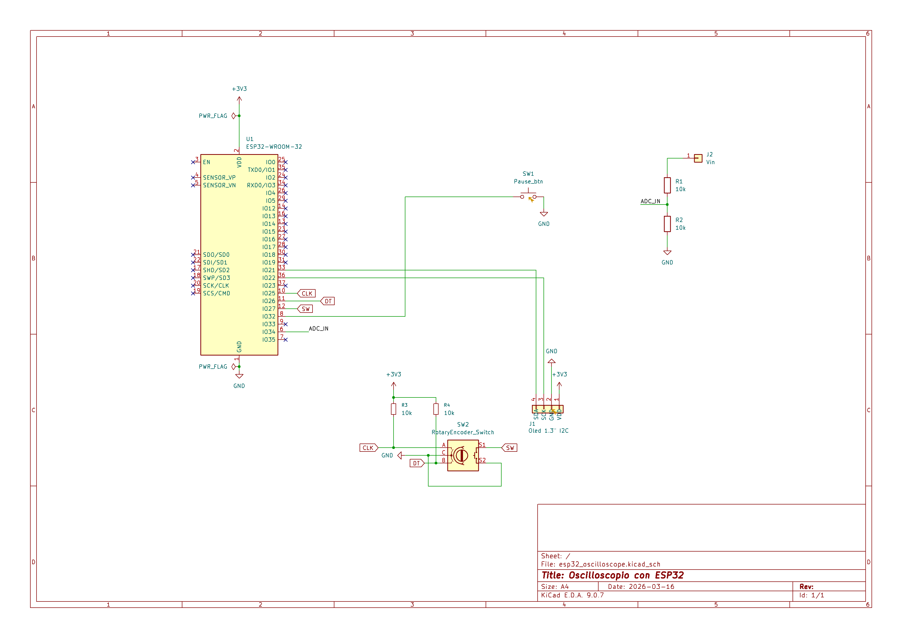

# ⚡ ESP32 Smart Oscilloscope (Dual-Core & Wi-Fi)

Un oscilloscopio digitale fai-da-te ad alte prestazioni basato su ESP32. Sfrutta il sistema operativo in tempo reale (FreeRTOS) per gestire l'acquisizione dei dati su un core dedicato, garantendo un'interfaccia fluida sia sul display OLED locale sia sul browser web tramite WebSockets.

## ✨ Caratteristiche Principali

* **Architettura Multi-Core (FreeRTOS):** Acquisizione del segnale sul Core 1 (nessun lag) e gestione interfaccia/Wi-Fi sul Core 0.
* **Interfaccia Web Bidirezionale:** Visualizza l'onda in tempo reale e controlla lo strumento (Pausa, regolazione Timebase tramite bottoni hold-to-repeat o inserimento manuale) direttamente dal browser del tuo smartphone o PC.
* **Controllo Hardware di Precisione:** Regola lo zoom temporale (da 20 µs a 100.000 µs) tramite un **Encoder Rotativo Digitale (KY-040)** gestito da una Macchina a Stati (State Machine) per un antirimbalzo perfetto e zero lag.
* **Display OLED Locale:** Supporto integrato per display I2C da 1.3" (Chip SH110X) con I2C overcloccato a 400kHz.
* **Digital Signal Processing (DSP):** Motore matematico avanzato con **Schmitt Trigger software** e isteresi (10%) per un calcolo solido della frequenza e della VMax.
* **Smart Trigger & Roll Mode:** Transizione automatica tra un'onda "congelata" (per segnali veloci) e uno scorrimento continuo (per segnali lenti).
* **Architettura OOP Modulare:** Driver hardware astratti (`SmartEncoder`, `SmartButton`) e file di configurazione centralizzato.

---

## 🧱 Architettura Modulare (Il file `config.h`)

Il firmware è altamente personalizzabile. Puoi accendere o spegnere interi blocchi del sistema utilizzando le direttive del preprocessore:
* `USE_DISPLAY`: Disattivalo per trasformare l'ESP32 in un data-logger "cieco".
* `USE_WIFI` / `USE_WEB_SERVER`: Gestisce la connettività e l'interfaccia remota.
* `USE_CONTROLS`: Abilita/disabilita i controlli fisici. Al suo interno puoi attivare `USE_ENCODER` e `USE_BUTTON`.
* `USE_SIMULATOR`: Sgancia l'hardware e genera un'onda matematica per testare la UI senza cavi fisici!

---

## 🛠️ Componenti Hardware Necessari

* 1x Scheda di sviluppo **ESP32** (es. DevKit V1)
* 1x Display **OLED I2C 1.3"** (Chip SH1106, indirizzo `0x3C`)
* 1x **Encoder Rotativo** (Modulo breakout tipo AZ-Delivery KY-040 con resistenze di pull-up integrate)
* 1x Pulsante fisico (Push-button)
* 2x Resistenze dello stesso valore (es. 10kΩ) per il partitore di tensione
* Breadboard e cavi jumper

---

### 📐 Schema Elettrico

Ecco lo schema dei collegamenti da realizzare. Per maggiori dettagli, puoi scaricare il [progetto KiCad e il PDF ufficiale nella cartella hardware/](hardware/).



---

## 🔌 Schema dei Collegamenti

| Componente | Pin ESP32 | Note Importanti |
| :--- | :--- | :--- |
| **Segnale In** | `GPIO 34` | **MAX 3.3V!** Il partitore dimezza il segnale d'ingresso. |
| **Encoder CLK** | `GPIO 25` | Genera gli impulsi di rotazione. |
| **Encoder DT** | `GPIO 26` | Determina la direzione della rotazione. |
| **Encoder + (VCC)**| `3.3V` | **Non alimentare a 5V**, altrimenti brucerai i pin dell'ESP32! |
| **Pulsante HOLD**| `GPIO 32` | Collegare l'altro piedino al `GND` (Pull-Up interno usato). |
| **OLED SDA** | `GPIO 21` | Linea dati I2C. |
| **OLED SCL** | `GPIO 22` | Linea di clock I2C. |
| **GND in Comune**| `GND` | **Cruciale:** Unire il GND del circuito in esame al GND dell'ESP32. |

> ⚠️ **AVVERTENZA DI SICUREZZA:** L'ADC dell'ESP32 tollera un massimo assoluto di 3.3V. Tensioni superiori danneggeranno irreparabilmente la scheda.

---

## 💻 Installazione e Software

Questo progetto è stato sviluppato utilizzando **PlatformIO**. 

1. **Clona questa repository:**
   ```bash
   git clone [https://github.com/TUO_NOME_UTENTE/NOME_REPO.git](https://github.com/TUO_NOME_UTENTE/NOME_REPO.git)